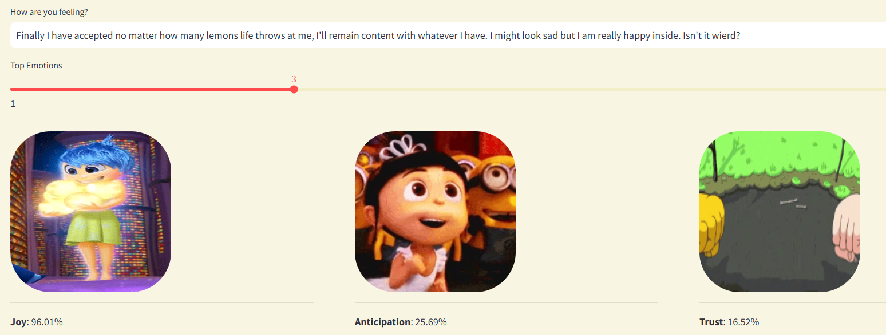

# Sentiment Analysis and Emotion Detection App



## Overview
This project uses **sentiment analysis** to detect and classify the emotions conveyed in text inputs. By analyzing user-submitted text, we can identify emotional tones and present a dynamic response. Using advanced embeddings and multi-label classification, this app detects emotions such as **joy**, **sadness**, **anger**, **trust**, and more.

## Demo Flow
1. **Gather Emotion Data**: Using an established dataset, we build the foundational data for emotion classification.
2. **Train Emotion Classifier**: A custom classifier model is trained on emotion-labeled embeddings.
3. **Get User Input**: Capturing user text input for analysis.
4. **Embed the Input**: Converting input text into embeddings for processing.
5. **Classify Sentiment**: Applying the classifier to predict emotions from input embeddings.
6. **Display Results**: Show the top emotions visually with corresponding animations.

## Tech Stack
- **Cohere API**: Generates multilingual text embeddings.
- **scikit-learn**: Implements multi-label classification.
- **Streamlit**: Provides a user interface for interaction.
- **PyTorch**: Handles embeddings as tensors and performs model operations.
- **Python Pickle**: Saves and loads the trained classifier model.

---

## Installation

1. **Clone the repository**:
   ```bash
   git clone https://github.com/your-username/sentiment-analysis-emotion-detection.git
   cd sentiment-analysis-emotion-detection
2. **Install dependencies**: 
   pip install -r requirements.txt
3. **Set up Cohere API key**:
    Sign up at Cohere and get your API key.
    Add your API key to the environment variables.
4. **Steps to run App**
    A.Gather Emotion Data

    The XED dataset(https://github.com/Helsinki-NLP/XED?ref=cohere-ai.ghost.io) provides emotion-labeled text samples, converted to embeddings using Cohere’s embed-multilingual-v3.0 model.
    Train the Emotion Classifier

    B.Open sentiment.py to explore the train_and_save function, where we prepare data for model training.
    A Classifier Chain with logistic regression predicts the emotion of each sample, saving the model to emotion_chain.pkl.
    Get User Input

    C.Use Streamlit’s st.text_input and st.slider functions for text and selection input.
    Embed the Input

    D.Convert user input into embeddings using get_embeddings from utils.py.
    Classify Sentiment

    E.Load emotion_chain.pkl and predict emotions using embeddings.
    Display Results

    Show the top predicted emotions, each visualized with a corresponding GIF image.